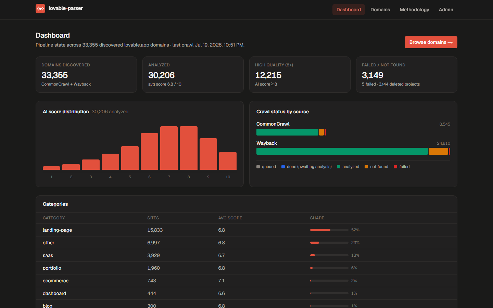
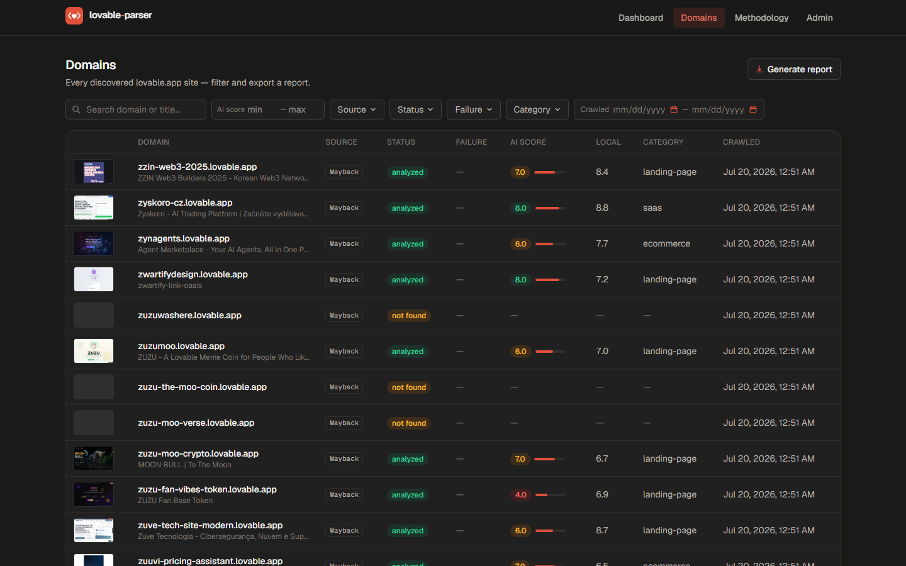
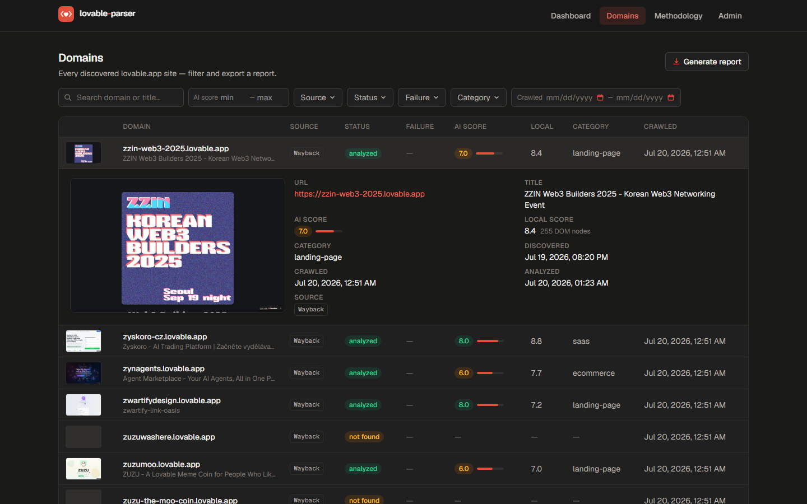
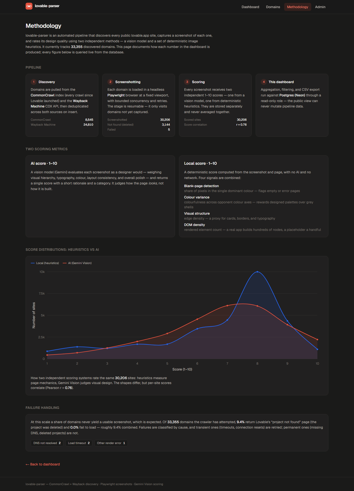
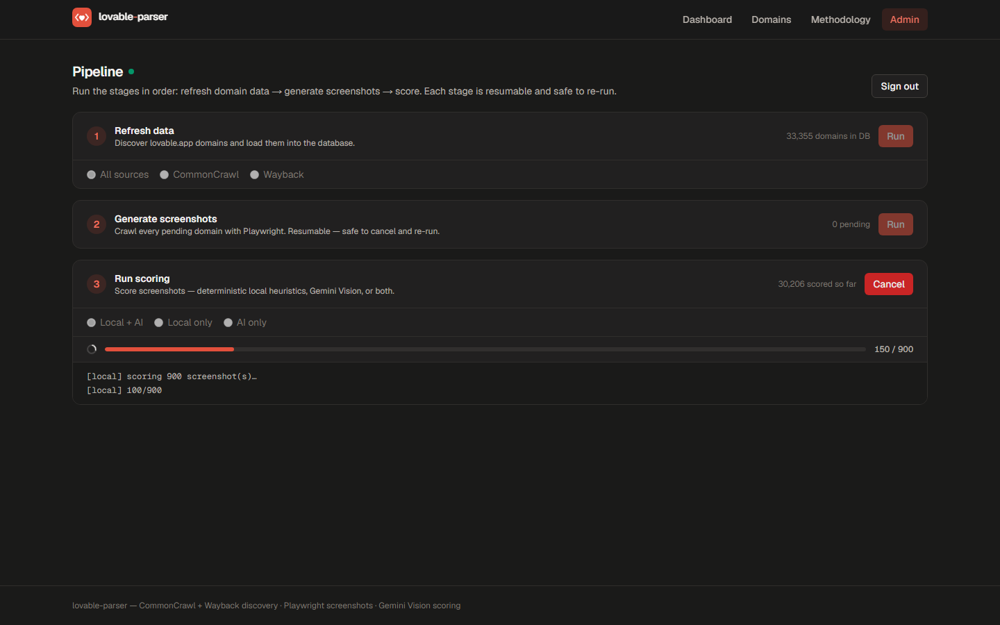

# lovable-parser

An automated pipeline that discovered **33k public `lovable.app` sites**, then screenshotted and scored **30k** of them for design quality two independent ways - a vision model and deterministic image heuristics - and serves the results through a fast, filterable dashboard.

[](https://lovable-parser.aviceday.workers.dev/)


> Exact live figures: **33,355 discovered domains**, **30,206 screenshotted & scored**, ~1 GB of WebP screenshots on Cloudflare R2 - all queried live from Postgres, nothing static.

> **My role.** Solo project, built by me with an AI coding agent - I owned the
> architecture (the server/edge split and the security-by-topology model), the
> two-metric scoring design, and the engineering decisions throughout.



---

## Highlights

- **Discovers the entire population**, not a sample - ~33 k `lovable.app` domains from CommonCrawl (every index since launch) + the Wayback Machine, deduplicated across sources.
- **Two independent design scores per site** - a Gemini Vision judgment and offline deterministic heuristics - stored separately and never merged (correlated at **r ≈ 0.76**, but they disagree per-site by design).
- **Resumable, idempotent pipeline** - every stage is safe to kill and restart; it only does work that isn't done yet.
- **Edge-deployed, read-only, and safe to expose** - the public app holds only a read-only DB role, so write paths auto-disable; the crawler with write credentials stays on the server tier.
- **Real scale, handled cheaply** - 8.6 GB of PNGs compressed to ~1 GB of WebP (8.6×) and served from R2's CDN, edge-cached, never touching the Worker.
- **Self-documenting** - a live `/methodology` page explains every number and charts the two scoring systems against each other.

---

## What it is

The heavy pipeline (discovery, headless browsing, scoring) runs on a backend server and writes to a hosted Postgres database; a read-only explorer is deployed to Cloudflare's edge so anyone can browse, filter, and export the results.

It's resumable and idempotent, handles tens of thousands of domains with per-source stats and failure classification, and is packaged behind a portfolio-quality UI.

---

## Screenshots

### Domains explorer
Every discovered site in one filterable, sortable table (search, score ranges, source, status, failure type, category, date range) - responsive at 30k+ rows. Thumbnails are served straight from R2's CDN.



### Domain detail
Expand any row for the full screenshot, both scores, category, and timestamps.



### Methodology
A live, self-documenting page: how each number is produced, the two scoring metrics, and a distribution chart comparing them - all queried live from the database.



### Admin pipeline - with live logs
A hidden, authenticated control panel runs the pipeline stages (discovery → screenshots → scoring) with streamed logs and live progress. Anonymous visitors see the same UI in a read-only state; mutation endpoints reject unauthenticated requests server-side.



---

## Architecture

```
  SERVER (write side)                       EDGE (read side)
┌───────────────────────┐                 ┌────────────────────────────┐
│  Backend pipeline      │   writes        │  Cloudflare Worker         │
│  (Python + Node.js)   │ ───────────────▶│  (Next.js via OpenNext)    │
│  · CommonCrawl/Wayback│   Neon Postgres │  · read-only admin_ro role │
│    discovery          │◀─────────────── │  · Dashboard / Domains /   │
│  · Playwright shots   │   reads (RO)    │    Methodology / CSV       │
│  · Gemini + heuristic │                 └────────────┬───────────────┘
│    scoring            │                              │  direct
│  · WebP → R2 upload   │                              ▼
└───────────┬───────────┘         ┌────────────────────────────┐
            │ screenshots         │  Cloudflare R2 (CDN)       │
            └────────────────────▶│  screenshots/<domain>.webp │
                                  └────────────────────────────┘
```

- **The pipeline runs on a backend server** - it needs a filesystem, a real headless browser, and write DB credentials, so it lives on the server tier rather than the edge.
- **The deployed app is read-only** - it only holds the read-only Postgres role, so the pipeline/refetch endpoints auto-disable (`501`). Keeping write creds off the edge deployment is what makes it safe to expose publicly.
- **Screenshots never touch the Worker** - the browser loads them directly from R2's custom-domain CDN, edge-cached (`cache-control: immutable`).

---

## How it works

**1. Discovery** - Domains are pulled from the CommonCrawl index (every crawl since Lovable launched) and the Wayback Machine CDX API, deduplicated across both sources. Silent page-loss is guarded with retries and explicit accounting.

**2. Screenshotting** - Each domain is loaded in a headless **Playwright** browser at a fixed viewport with bounded concurrency and retries. Fully resumable - it only visits domains not yet captured. Failures are classified (timeout / DNS / deleted project / render error) and transient ones retried.

**3. Scoring - two independent metrics per site**, stored separately and never averaged:
- **AI score (1–10)** - a Gemini Vision model judges visual hierarchy, typography, colour, layout, and polish.
- **Local score (1–10)** - deterministic heuristics computed with no AI: blank-page detection, colour variance, edge density, and DOM node count.

They correlate (Pearson **r ≈ 0.76**) but disagree on individual sites - the heuristics measure page mechanics, the AI judges aesthetics.

**4. This dashboard** - aggregation, filtering, and CSV export run against Postgres through the read-only role.

---

## Engineering highlights

- **Security by topology.** The deployed Worker is given *only* the read-only `admin_ro` Postgres role and no write credentials. Mutation endpoints detect the missing role and return `501` automatically - so the public site is safe to expose without a single feature flag to misconfigure.
- **Runs the same codebase on Node and the edge.** The write-only bits (`child_process`, `fs`) are dynamically imported behind runtime guards, and CSV export was reimplemented in SQL/JS (RFC 4180) instead of shelling out - so the exact same Next.js app bundles for Cloudflare Workers via OpenNext and runs locally.
- **Failure accounting in discovery.** CommonCrawl's index servers 503 under load; a naïve fetcher silently drops whole pages. This one retries with backoff and *counts* lost pages, turning silent data loss into a visible number.
- **Two-metric scoring, kept honest.** AI and heuristic scores live in separate columns and are never averaged. The `/methodology` page charts their distributions and reports the live Pearson correlation from the same query that draws the chart - one source of truth.
- **Cost-aware media.** Screenshots are converted to WebP (8.6× smaller), uploaded to R2 with immutable cache headers, and served directly from a CDN domain - the Worker spends zero CPU on images.
- **Streamed pipeline UX.** The admin panel runs each stage as a spawned process and streams its stdout to the browser as ndjson, with live progress derived from live DB queue depths.

---

## Tech stack

| Layer | Tech |
|---|---|
| Discovery / scoring | Python (aiohttp, Pillow), Node.js |
| Screenshots | Playwright (headless Chromium) |
| AI scoring | Gemini Vision |
| Database | Neon (serverless Postgres) - `crawler_rw` + `admin_ro` roles |
| Web app | Next.js 15 (App Router) + TypeScript + Tailwind v4 |
| Edge deploy | Cloudflare Workers via OpenNext, `@neondatabase/serverless` |
| Image storage | Cloudflare R2 (WebP, served via CDN custom domain) |

---

## Running the pipeline (server side)

```powershell
cp .env.example .env          # fill in GEMINI_API_KEY, DATABASE_URL, etc.
npm install
npx playwright install chromium
pip install -r requirements.txt
```

One-time database setup (creates the schema + `crawler_rw`/`admin_ro` roles on Neon):

```powershell
python scripts/migrate_to_neon.py
```

Then the pipeline - each step is safe to re-run and resumes where it stopped:

```powershell
npm run fetch          # discover domains (CommonCrawl + Wayback)
npm run crawl          # screenshot pending domains (Playwright)
npm run analyze        # score: local heuristics + AI, export results
npm run stats          # status counts, per-source breakdown, score distribution
```

Screenshots → R2 (WebP):

```powershell
python scripts/prepare_screenshots.py     # PNG → WebP + size report
python scripts/upload_screenshots_r2.py   # upload to R2, set screenshot_key
```

The admin panel (dashboard + pipeline control):

```powershell
npm run admin          # dev server → http://localhost:3000
```

---

## Deploying the explorer to Cloudflare

The web app lives in [`admin/`](admin/) and deploys to Cloudflare Workers via OpenNext:

```powershell
cd admin
npm run cf:deploy
# then set read-only secrets on the Worker:
npx wrangler secret put ADMIN_DATABASE_URL   # the admin_ro role
npx wrangler secret put ADMIN_USER
npx wrangler secret put ADMIN_PASSWORD
```

Screenshot serving via the R2 custom-domain CDN is documented in [`admin/SETUP.md`](admin/SETUP.md).

---

## Known limitations

- **Discovery is only as complete as the indexes.** Coverage is bounded by what CommonCrawl and the Wayback Machine have seen - a `lovable.app` site that neither ever indexed is invisible to the pipeline. It's the entire *discoverable* population, not a proof of the entire population.
- **The AI score reflects one model's taste.** The Gemini Vision score is a single model's aesthetic judgment at one point in time; re-scoring with a different model (or a newer Gemini) would shift absolute values, which is exactly why AI and heuristic scores are kept in separate columns and never merged.
- **Screenshots are a point-in-time snapshot.** Each capture reflects the site on the day it was crawled; live sites drift, and re-capturing at scale is a deliberate re-run, not continuous.
- **Public deploy is read-only by design.** The exposed app holds only the `admin_ro` role, so the pipeline can't be driven from the public URL - running it requires the server tier with write credentials. That's the security model, but it does mean the live demo is an explorer, not a control panel.

---

## Notes

- A 5–10% failure/not-found rate across all discovered domains is normal - Wayback in particular remembers many since-deleted projects.
- The two scores live in separate columns (`ai_score`, `local_score`) and are never merged; the AI pass can cleanly overwrite scores keyed on the `ai_score` field.
- Everything on the deployed site is queried live from Postgres - no static snapshots.
